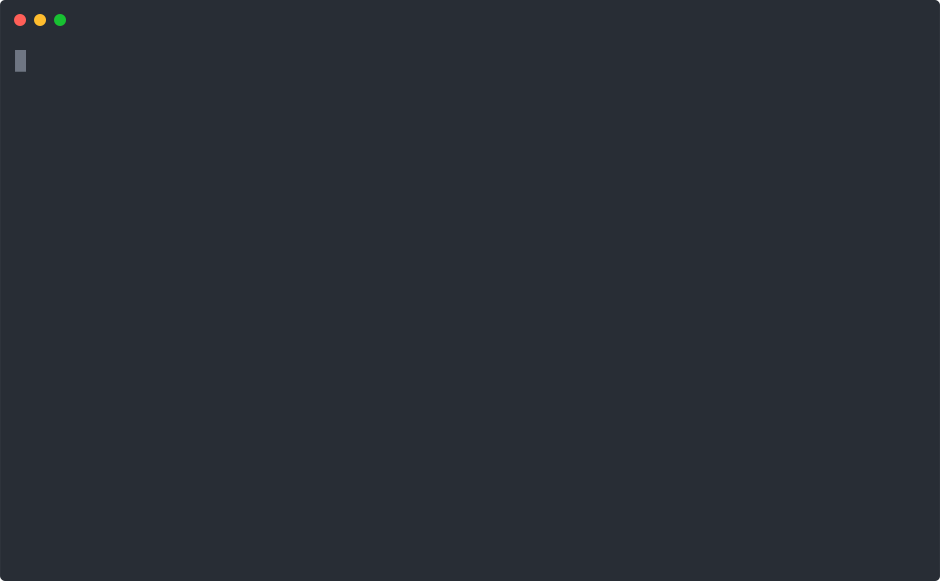

# Create Divi Extension [](https://circleci.com/gh/elegantthemes/create-divi-extension)

Create Divi Extensions with no build configuration.

* [Creating an Extension](#creating-an-extension) – How to create a new extension.
* [User Guide](https://github.com/elegantthemes/create-divi-extension/blob/master/packages/divi-scripts/template/README.md) – How to develop extensions bootstrapped with Create Divi Extension.

Create Divi Extension works on macOS, Windows, and Linux. If something doesn’t work, please [file an issue](https://github.com/elegantthemes/create-divi-extension/issues/new).

## Quick Overview

```sh
npx create-divi-extension my-extension
cd my-extension
yarn start
```

*([npx](https://medium.com/@maybekatz/introducing-npx-an-npm-package-runner-55f7d4bd282b) comes with npm 5.2+ and higher, see [instructions for older npm versions](https://gist.github.com/gaearon/4064d3c23a77c74a3614c498a8bb1c5f))*

Then open your WordPress site to see your extension. When you’re ready to deploy to production, create a minified bundle with `yarn build`.

<p align='center'>

</p>

### Get Started Immediately

You **don’t** need to install or configure tools like Webpack or Babel. They are preconfigured and hidden so that you can focus on the code.

Just create a project, and you’re good to go.

## Creating an Extension

**You’ll need to have Node >= 6 on your local development machine**.

To create a new extension, run a single command:

```sh
npx create-divi-extension my-extension
```

*([npx](https://medium.com/@maybekatz/introducing-npx-an-npm-package-runner-55f7d4bd282b) comes with npm 5.2+ and higher, see [instructions for older npm versions](https://gist.github.com/gaearon/4064d3c23a77c74a3614c498a8bb1c5f))*

It will create a directory called `my-extension` inside the current directory. Inside that directory, it will generate the initial project structure and install the transitive dependencies:

```
my-extension
├── includes
│   ├── modules
│   │   └── HelloWorld
│   │       ├── HelloWorld.jsx
│   │       ├── HelloWorld.php
│   │       └── style.css
│   ├── loader.js
│   ├── loader.php
│   └── MyExtension.php
├── languages
├── node_modules
├── scripts
│   └── frontend.js
├── styles
├── my-extension.php
├── package.json
└── README.md
```

No configuration or complicated folder structures, just the files you need to build your extension. Once the installation is done, you can open your project folder:

```sh
cd my-extension
```

Inside the newly created project, you can run some built-in commands:

### `npm start` or `yarn start`

Runs the extension in development mode. Open your WordPress website to view it.

The page will automatically reload if you make changes to the code. You will see the build errors and lint warnings in the console.

<p align='center'>

</p>

### `npm run build` or `yarn build`

Builds the extension for production. It correctly optimizes the build for the best performance.

The build is minified. Your extension is ready to be deployed.

### `npm run zip` or `yarn zip`

Runs `build` and then creates a production release zip file.

## User Guide

The [User Guide](https://github.com/elegantthemes/create-divi-extension/blob/master/packages/divi-scripts/template/README.md) includes information on different topics, such as:

- [Updating to New Releases](https://github.com/elegantthemes/create-divi-extension/blob/master/packages/divi-scripts/template/README.md#updating-to-new-releases)
- [Folder Structure](https://github.com/elegantthemes/create-divi-extension/blob/master/packages/divi-scripts/template/README.md#folder-structure)
- [Available Scripts](https://github.com/elegantthemes/create-divi-extension/blob/master/packages/divi-scripts/template/README.md#available-scripts)
- [Supported Browsers](https://github.com/elegantthemes/create-divi-extension/blob/master/packages/divi-scripts/template/README.md#supported-browsers)
- [Supported Language Features and Polyfills](https://github.com/elegantthemes/create-divi-extension/blob/master/packages/divi-scripts/template/README.md#supported-language-features-and-polyfills)
- [Syntax Highlighting in the Editor](https://github.com/elegantthemes/create-divi-extension/blob/master/packages/divi-scripts/template/README.md#syntax-highlighting-in-the-editor)
- [Displaying Lint Output in the Editor](https://github.com/elegantthemes/create-divi-extension/blob/master/packages/divi-scripts/template/README.md#displaying-lint-output-in-the-editor)
- [Formatting Code Automatically](https://github.com/elegantthemes/create-divi-extension/blob/master/packages/divi-scripts/template/README.md#formatting-code-automatically)
- [Debugging in the Editor](https://github.com/elegantthemes/create-divi-extension/blob/master/packages/divi-scripts/template/README.md#debugging-in-the-editor)
- [Installing a Dependency](https://github.com/elegantthemes/create-divi-extension/blob/master/packages/divi-scripts/template/README.md#installing-a-dependency)
- [Importing a Component](https://github.com/elegantthemes/create-divi-extension/blob/master/packages/divi-scripts/template/README.md#importing-a-component)
- [Adding a Stylesheet](https://github.com/elegantthemes/create-divi-extension/blob/master/packages/divi-scripts/template/README.md#adding-a-stylesheet)
- [Post-Processing CSS](https://github.com/elegantthemes/create-divi-extension/blob/master/packages/divi-scripts/template/README.md#post-processing-css)
- [Adding a CSS Preprocessor (Sass, Less etc.)](https://github.com/elegantthemes/create-divi-extension/blob/master/packages/divi-scripts/template/README.md#adding-a-css-preprocessor-sass-less-etc)
- [Adding Images, Fonts, and Files](https://github.com/elegantthemes/create-divi-extension/blob/master/packages/divi-scripts/template/README.md#adding-images-fonts-and-files)
- [Adding Flow](https://github.com/elegantthemes/create-divi-extension/blob/master/packages/divi-scripts/template/README.md#adding-flow)
- [Adding Custom Environment Variables](https://github.com/elegantthemes/create-divi-extension/blob/master/packages/divi-scripts/template/README.md#adding-custom-environment-variables)
- [Can I Use Decorators?](https://github.com/elegantthemes/create-divi-extension/blob/master/packages/divi-scripts/template/README.md#can-i-use-decorators)
- [Fetching Data with AJAX Requests](https://github.com/elegantthemes/create-divi-extension/blob/master/packages/divi-scripts/template/README.md#fetching-data-with-ajax-requests)
- [Running Tests](https://github.com/elegantthemes/create-divi-extension/blob/master/packages/divi-scripts/template/README.md#running-tests)
- [Debugging Tests](https://github.com/elegantthemes/create-divi-extension/blob/master/packages/divi-scripts/template/README.md#debugging-tests)
- [Deployment](https://github.com/elegantthemes/create-divi-extension/blob/master/packages/divi-scripts/template/README.md#deployment)
- [Advanced Configuration](https://github.com/elegantthemes/create-divi-extension/blob/master/packages/divi-scripts/template/README.md#advanced-configuration)
- [Troubleshooting](https://github.com/elegantthemes/create-divi-extension/blob/master/packages/divi-scripts/template/README.md#troubleshooting)

A copy of the user guide will be created as `README.md` in your project folder.

## Philosophy

* **One Dependency:** There is just one build dependency. It uses Webpack, Babel, ESLint, and other amazing projects, but provides a cohesive curated experience on top of them.

* **No Configuration Required:** You don't need to configure anything. Reasonably good configuration of both development and production builds is handled for you so you can focus on writing code.

* **No Lock-In:** You can “eject” to a custom setup at any time. Run a single command, and all the configuration and build dependencies will be moved directly into your project, so you can pick up right where you left off.

## What’s Included?

Your environment will have everything you need to build a Divi extension:

* React, JSX, ES6, and optional Flow syntax support.
* Language extras beyond ES6 like the object spread operator.
* Auto prefixed CSS, so you don’t need `-webkit-` or other prefixes.
* A fast interactive unit test runner with built-in support for coverage reporting.
* A live development server that warns about common mistakes.
* A build script to bundle JS, CSS, and images for production, with hashes and sourcemaps.
* Hassle-free updates for the above tools via a single dependency.

Check out [this guide](https://github.com/nitishdayal/cra_closer_look) for an overview of how these tools fit together.

The tradeoff is that **these tools are preconfigured to work in a specific way**. If your project needs more customization, you can ["eject"](https://github.com/elegantthemes/create-divi-extension/blob/master/packages/divi-scripts/template/README.md#npm-run-eject) and customize it, but then you will need to maintain the configuration.

## Contributing

We'd love to have your helping hand on `create-divi-extension`! See [CONTRIBUTING.md](CONTRIBUTING.md) for more information on what we're looking for and how to get started.

## Acknowledgements

We are grateful to the authors of [`create-react-app`](https://github.com/facebook/create-react-app) for creating the awesome tool on which `create-divi-extension` is based.
